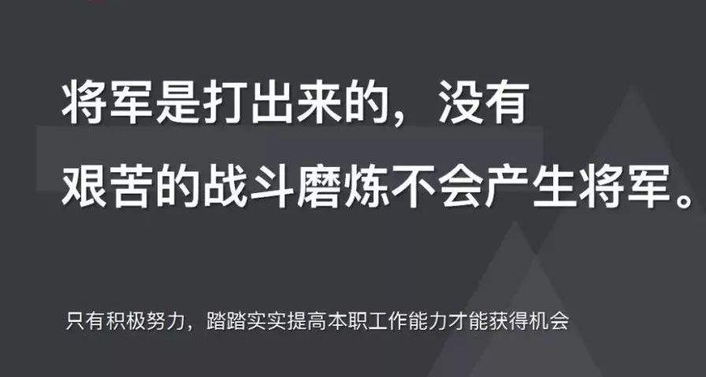

 
## 前言

本人平时学习及收集内容，欢迎参入一起讨论。

## 关于作者

暂时欠着

1. [科学上网](https://github.com/hoodiearon/fq-book)
1. [自建ssr服务器教程](https://github.com/Alvin9999/new-pac/wiki/%E8%87%AA%E5%BB%BAss%E6%9C%8D%E5%8A%A1%E5%99%A8%E6%95%99%E7%A8%8B)
1. [英语学习指南](https://github.com/yujiangshui/A-Programmers-Guide-to-English)
1. [英语进阶指南](https://github.com/ftTony/English-level-up-tips-for-Chinese)
1. [暴力英语学习法 + 严格的目标管理 = 成功快速靠谱的学好英语](https://www.cnblogs.com/jesse2013/p/how-to-learn-english.html)
1. [房产信息](https://github.com/fairyly/you-need-know-house_knowledge)
1. [笔记/搜集/摘录/实践](https://github.com/jaywcjlove/handbook)
1. [程序员需要懂得的中医养生](https://github.com/fairyly/you-need-traditional-Chinese-medical)

## 联系作者

    

        在颠覆世界的同时，也要好好关照自己。
    

    

